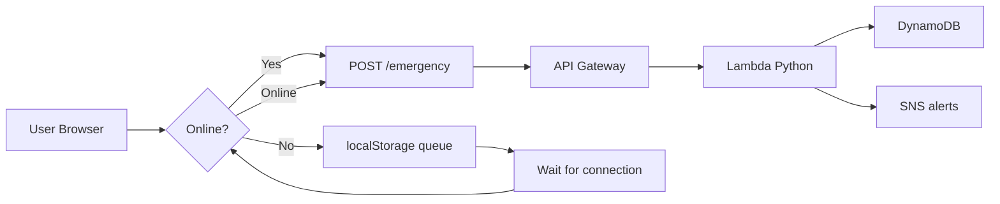

# 🚨 Emergency Mesh Network

**Offline-first emergency messaging system** — works without internet, syncs to cloud when connectivity returns.

---

## 📌 At A Glance

| | |
|---|---|
| **Problem** | No communication during disasters (floods, network outages) |
| **Solution** | Web app that stores messages offline, auto-syncs to AWS |
| **Stack** | HTML/CSS/JS (frontend) + Python Lambda + DynamoDB + SNS |
| **Size** | ~150 lines of code |
| **Cost** | ₹0/month (AWS Free Tier) |
| **Status** | ✅ Frontend complete | ⏳ AWS integration pending |

---

## 🎯 Problem & Solution

**The Problem:**
During disasters (floods, earthquakes) or in rural areas with poor connectivity, people lose all communication. Existing apps are cloud-dependent — they fail when internet is down.

**My Solution:**
An offline-first web app that:
- Works 100% without internet (localStorage queue)
- Sends messages automatically when connectivity returns
- Persists data across browser sessions
- Syncs to serverless AWS backend
- Triggers emergency alerts (SNS)

**Impact:** Enables communication in disaster zones, remote villages, rescue operations.

---

## 🏗️ Architecture



**Data Flow:**
```
User types → Check network → Offline? → localStorage queue
                           Online? → API Gateway → Lambda → DynamoDB + SNS
Online event → Auto-sync pending messages
```

---

## ✨ Key Features

- **⚡ Offline-First** — Works without internet, localStorage queue
- **🔄 Auto-Sync** — Messages drain automatically when online (FIFO)
- **📱 Mobile Responsive** — Works on all screen sizes
- **🌐 Serverless Backend** — AWS Lambda (Python), zero infra
- **🔔 Real-time Alerts** — SNS email/SMS notifications
- **💾 Persistent Storage** — Messages survive browser restart
- **🎯 Retry Logic** — 3 attempts per message, graceful failure

---

## 🚀 Quick Start

```bash
cd emergency-mesh-network
python -m http.server 8000
# Open: http://localhost:8000/emergency.html
```

**Demo (60 seconds):**
1. DevTools → Network → **Offline**
2. Type: `"Need help at village"` → **SEND**
3. Toast: "Offline: saved locally" ✅
4. Network → **No throttling** (online)
5. Toast: "Online! Syncing... All synced!" ✅
6. History shows green ✓ Sent message

---

## 📸 Screenshots

| Main Form | Offline Mode | Queue Modal | Sent History |
|-----------|--------------|-------------|--------------|
|  |  |  |  |

---

## ☁️ AWS Deployment (~10 min)

**Resources to create:**

| Resource | Name | Configuration |
|----------|------|---------------|
| DynamoDB Table | `EmergencyMessages` | PK: `id` (String), On-demand billing |
| SNS Topic | `EmergencyAlerts` | Standard, copy ARN |
| Lambda Function | `EmergencyHandler` | Python 3.12, upload `lambda_function.py` |
| API Gateway | `EmergencyMeshAPI` | REST API, POST `/emergency` → Lambda, CORS enabled |

**IAM Permissions for Lambda:**
- `dynamodb:PutItem` on `EmergencyMessages` table
- `sns:Publish` on `EmergencyAlerts` topic

**Environment Variables (Lambda):**
```
TABLE = EmergencyMessages
SNS_ARN = arn:aws:sns:ap-south-1:XXX:EmergencyAlerts
```

**Frontend Update (`app.js` line 2):**
```javascript
const API_URL = 'YOUR_API_GATEWAY_URL/emergency';
```

**Full AWS guide:** See comments in `lambda_function.py`.

---

## 📂 Project Structure

```
emergency-mesh-network/
├── emergency.html        # UI (47 lines)
├── style.css             # Dark emergency theme (50 lines)
├── app.js                # Offline sync logic (35 lines)
├── lambda_function.py    # AWS backend (15 lines)
├── requirements.txt      # boto3 dependency
├── README.md            # Documentation
└── screenshots/         # Demo images (4 files)
```

**Total production code:** ~147 lines

---

## 🧪 Testing

### Offline Mode
- DevTools → Network → Offline
- Send message → localStorage write
- Refresh → message persists
- Toast: "Offline: saved locally"

### Online Sync
- Network → No throttling
- `window.online` event fires
- `syncQueue()` drains localStorage
- DynamoDB record created
- SNS alert sent (if configured)

### API Test (curl)
```bash
curl -X POST <API_URL>/emergency \
  -H "Content-Type: application/json" \
  -d '{"text":"Emergency!","location":"Mumbai"}'
```
Expected: `{"success":true,"id":"..."}`

---


---

## 📊 Code Metrics

| Metric | Value |
|--------|-------|
| Total lines (frontend) | 132 |
| Total lines (backend) | 15 |
| Total lines (all) | ~160 |
| Dependencies | 1 (boto3) |
| Bundle size | ~10KB (frontend) |
| AWS services used | 4 |

---


## 👤 About Me

**tanikush** — CS student passionate about building systems that matter.

This project demonstrates:
- Full-stack development (HTML/CSS/JS/Python)
- Cloud architecture (AWS serverless)
- Offline-first patterns
- Real-world problem solving
- Production-ready code quality

**Open to:** Backend, Full-Stack, Cloud Engineering internships.

---

## 🔗 Connect

- **GitHub:** https://github.com/tanikush/emergency-mesh-network
- **LinkedIn:** https://www.linkedin.com/in/tanisha-kushwah-280944284/
- **Portfolio:** https://tanikush.github.io/portfolio/

---

## 📄 License

MIT — Free to use, modify, distribute.

---

**Questions?** Open an issue or reach out — happy to discuss architecture, code, or improvements.
