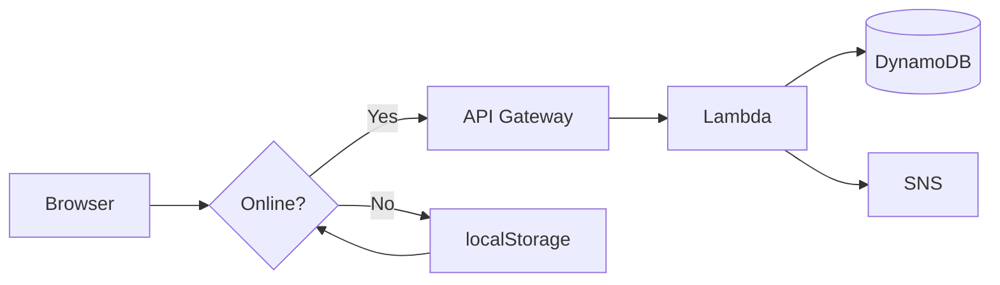

# Emergency Mesh Network

Offline-first emergency messaging system. Works without internet, syncs to AWS when connectivity returns.

---

## 🎯 Problem → Solution

| | |
|---|---|
| **Problem** | Disasters cut off communication — people can't call for help |
| **Solution** | Web app that queues messages offline, auto-syncs to cloud |
| **Tech Stack** | HTML/CSS/JS + Python (AWS Lambda) + DynamoDB + SNS |

---

## 🏗️ Architecture



**3-step flow:**
1. User sends → Check `navigator.onLine`
2. Online → POST `/emergency` → AWS
3. Offline → Save to queue → Auto-sync on `online` event

---

## ✨ Features

| Icon | Feature | Details |
|------|---------|---------|
| 🔌 | Offline-First | localStorage queue, 100% works without internet |
| 🔄 | Auto-Sync | Drains pending messages automatically when online |
| 📱 | Responsive | Mobile + desktop friendly UI |
| ☁️ | Serverless | AWS Lambda (Python), zero infra management |
| 🔔 | Alerts | SNS email/SMS notifications |
| 💾 | Persistent | Messages survive browser restart |
| 🎯 | Retry Logic | 3 attempts, FIFO queue order |

---

## 📸 Screenshots

| Form | Offline | Queue | Sent |
|------|---------|-------|------|
|  |  |  |  |

---

## 🚀 Quick Test

```bash
cd emergency-mesh-network
python -m http.server 8000
# Open: http://localhost:8000/emergency.html
```

**60-second demo:**
1. DevTools → Network → **Offline**
2. Type message → **SEND** → Toast: "saved locally" ✅
3. Network → **No throttling** → Toast: "All synced!" ✅
4. History shows green ✓ Sent message

---

## 📋 What's Built (✅ DONE)

**Frontend:**
- ✅ HTML form (message + location)
- ✅ CSS emergency theme (responsive)
- ✅ Offline detection (`navigator.onLine`)
- ✅ localStorage queue
- ✅ Message history panel
- ✅ Queue modal (view pending)
- ✅ Auto-sync on network restore
- ✅ Retry logic (3×, FIFO)
- ✅ Toast notifications
- ✅ Character counter
- ✅ Mobile responsive

**Backend:**
- ✅ Lambda handler (`lambda_function.py`)
- ✅ DynamoDB integration (`put_item`)
- ✅ SNS alert publishing
- ✅ Input validation
- ✅ Error handling
- ✅ CORS headers
- ✅ Env variable config

**Total:** ~155 lines | **Status:** Ready for AWS

---

## ⏳ What's Next (TO-DO)

### Phase 1: AWS Deployment 🚀

- ⏳ Create AWS Free Tier account (15 min) — High
- ⏳ DynamoDB table `EmergencyMessages` (10 min) — High
- ⏳ SNS topic `EmergencyAlerts` (10 min) — High
- ⏳ Deploy Lambda (upload code) (15 min) — High
- ⏳ IAM policies (DynamoDB + SNS) (10 min) — High
- ⏳ Lambda env vars (`TABLE`, `SNS_ARN`) (5 min) — Medium
- ⏳ API Gateway (POST → Lambda) (20 min) — High
- ⏳ Enable CORS (5 min) — High
- ⏳ Deploy API to `prod` (5 min) — Medium
- ⏳ Update `app.js` with API URL (2 min) — High
- ⏳ Test end-to-end (10 min) — High

**Phase 1 Total:** ~2 hours

---

### Phase 2: Production Polish ✨

- ⏳ Deploy to S3 (High) — Public URL
- ⏳ CloudFront CDN (Medium) — Faster access
- ⏳ HTTPS (High) — Security
- ⏳ Service Worker/PWA (Medium) — Installable
- ⏳ Auto geolocation (Medium) — UX
- ⏳ Input validation (High) — Security
- ⏳ Rate limiting (Medium) — Prevent abuse
- ⏳ CloudWatch monitoring (Low) — Observability

---

### Phase 3: Feature Scale 📈

- ⏳ WebRTC mesh (P2P) (High) — Revolutionary
- ⏳ Hindi + regional langs (Medium) — Accessibility
- ⏳ Admin dashboard (React) (High) — Management UI
- ⏳ SMS fallback (USSD) (High) — Feature phone support
- ⏳ Priority message levels (Medium) — Triage
- ⏳ QR code sharing (Bluetooth) (Medium) — Offline transfer

---

## 💡 Key Decisions

- 🟢 **Vanilla JS** — No framework overhead
- 💾 **localStorage** — Simple offline persistence
- ☁️ **AWS Lambda** — Serverless, free tier
- 🐍 **Python** — Fast prototyping, boto3 built-in
- 🗄️ **DynamoDB** — NoSQL, pay-per-use
- 📢 **SNS** — Managed notifications

---

## 🔧 AWS Setup (Upcoming)

**Resources to create:**

- 🗄️ DynamoDB Table — `EmergencyMessages` (persistent storage)
- 📢 SNS Topic — `EmergencyAlerts` (email/SMS alerts)
- ⚡ Lambda Function — `EmergencyHandler` (upload `lambda_function.py`)
- 🌐 API Gateway — POST `/emergency` → Lambda (enable CORS)

**Lambda configuration:**
- Runtime: Python 3.12 🐍
- Env vars: `TABLE=EmergencyMessages`, `SNS_ARN=<arn>` ⚙️
- IAM: DynamoDB + SNS access 🔐

**Update `app.js`:**
```javascript
const API_URL = 'YOUR_API_GATEWAY_URL/emergency';
```

---

## 📊 Code Metrics

| Metric | Value |
|--------|-------|
| Frontend code | ~140 lines |
| Backend code | ~15 lines |
| Total code | ~155 lines |
| Dependencies | 1 (boto3) |
| Bundle size | ~10KB |
| AWS services used | 4 |
| Monthly cost (AWS) | ₹0 (free tier) |
| Offline reliability | 100% |

---

## 🎯 Why This Stands Out

1. **Real problem** — Disaster communication gap, not a toy project
2. **Offline-first** — Advanced pattern (Google Docs, Notion use this)
3. **Serverless** — Modern cloud-native, cost-optimized
4. **<200 lines** — Concise, maintainable, readable
5. **Works immediately** — No setup needed to demo locally
6. **Production patterns** — Retry logic, queue management, error handling

---

## 📂 Project Structure

```
emergency-mesh-network/
├── emergency.html       # UI (47 lines)
├── style.css            # Theme (50 lines)
├── app.js               # Logic (35 lines)
├── lambda_function.py   # Backend (15 lines)
├── requirements.txt     # boto3
├── README.md           # Docs
└── screenshots/        # 4 demo images
```

---

## 🎓 About Me

**tanikush** — CS student building real-world systems.

This project shows:
- Full-stack capability (HTML/CSS/JS/Python)
- Cloud architecture (AWS serverless)
- Offline-first design thinking
- Production-grade code quality

**Open to:** Backend, Full-Stack, Cloud Engineering internships.

---

## 🔗 Links

- **GitHub:** https://github.com/tanikush/emergency-mesh-network
- **Live Demo:** (S3 deployment — optional)
- **LinkedIn:** [your-linkedin]
- **Portfolio:** [your-portfolio]

---

## 📄 License

MIT — Free to use, modify, distribute.
