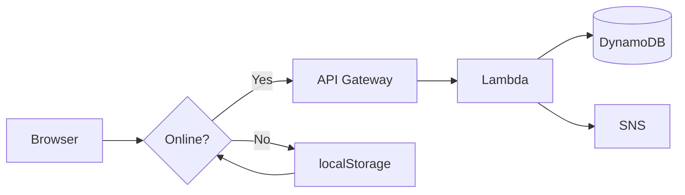

# Emergency Mesh Network

Offline-first emergency messaging system. Works without internet, syncs to AWS when connectivity returns.

---

## 🎯 Problem → Solution

| | |
|---|---|
| **Problem** | Disasters cut off communication — people can't call for help |
| **Solution** | Web app that queues messages offline, auto-syncs to cloud |
| **Tech Stack** | HTML/CSS/JS + Python (AWS Lambda) + DynamoDB + SNS |

---

## 🏗️ Architecture



**3-step flow:**
1. User sends → Check `navigator.onLine`
2. Online → POST `/emergency` → AWS
3. Offline → Save to queue → Auto-sync on `online` event

---

## ✨ Features

| Icon | Feature | Details |
|------|---------|---------|
| 🔌 | Offline-First | localStorage queue, 100% works without internet |
| 🔄 | Auto-Sync | Drains pending messages automatically when online |
| 📱 | Responsive | Mobile + desktop friendly UI |
| ☁️ | Serverless | AWS Lambda (Python), zero infra management |
| 🔔 | Alerts | SNS email/SMS notifications |
| 💾 | Persistent | Messages survive browser restart |
| 🎯 | Retry Logic | 3 attempts, FIFO queue order |

---

## 📸 Screenshots

| Form | Offline | Queue | Sent |
|------|---------|-------|------|
|  |  |  |  |

---

## 🚀 Quick Test

```bash
cd emergency-mesh-network
python -m http.server 8000
# Open: http://localhost:8000/emergency.html
```

**60-second demo:**
1. DevTools → Network → **Offline**
2. Type message → **SEND** → Toast: "saved locally" ✅
3. Network → **No throttling** → Toast: "All synced!" ✅
4. History shows green ✓ Sent message

---

## 📋 What's Built (✅ DONE)

| Component | Status | Details |
|-----------|--------|---------|
| **Frontend UI** | ✅ | HTML form, history panel, queue modal |
| **Styling** | ✅ | Mobile-responsive dark emergency theme |
| **Offline Logic** | ✅ | localStorage queue, auto-sync, retry |
| **Backend Code** | ✅ | Lambda function (DynamoDB + SNS) |
| **Screenshots** | ✅ | 4 demo images captured |
| **Documentation** | ✅ | README, code comments |
| **GitHub** | ✅ | Repository live, commits pushed |

**Code footprint:** ~155 lines total (frontend ~140 + backend ~15)

---

## ⏳ What's Next (TO-DO)

### Phase 1: AWS Deployment 🚀

| Task | Status | Notes |
|------|--------|-------|
| Create AWS account | ⏳ | Free Tier signup |
| DynamoDB table | ⏳ | `EmergencyMessages` (PK: id) |
| SNS topic | ⏳ | `EmergencyAlerts`, confirm subscription |
| Lambda deployment | ⏳ | Upload `lambda_function.py` + env vars |
| API Gateway | ⏳ | POST `/emergency` → Lambda, enable CORS |
| Update API URL | ⏳ | Edit `app.js` line 2 with endpoint |
| End-to-end test | ⏳ | Verify message → DynamoDB flow |

### Phase 2: Polish ✨

| Task | Priority |
|------|----------|
| Deploy to S3 (public URL) | High |
| Service Worker (PWA) | Medium |
| Auto geolocation | Medium |
| Input validation | High |
| Rate limiting | Medium |

### Phase 3: Scale 📈

| Feature | Complexity |
|---------|------------|
| WebRTC mesh (P2P) | High |
| Hindi + regional langs | Medium |
| Admin dashboard | High |
| SMS fallback (USSD) | High |

---

## 💡 Key Decisions

| Decision | Choice | Why |
|----------|-------|-----|
| **Framework** | Vanilla JS | No overhead, easy to review |
| **Offline storage** | localStorage | Simple, sufficient for demo |
| **Backend** | AWS Lambda | Serverless, free tier, scalable |
| **Language** | Python | Fast prototyping, boto3 built-in |
| **Database** | DynamoDB | NoSQL, serverless, pay-per-use |
| **Notifications** | SNS | Managed, multi-protocol |

---

## 🔧 AWS Setup (Upcoming)

**Resources to create:**

| Resource | Name | Purpose |
|----------|------|---------|
| DynamoDB Table | `EmergencyMessages` | Persistent message storage |
| SNS Topic | `EmergencyAlerts` | Email/SMS emergency alerts |
| Lambda Function | `EmergencyHandler` | Backend logic (upload `lambda_function.py`) |
| API Gateway | POST `/emergency` | HTTP endpoint → Lambda integration |

**Lambda configuration:**

| Setting | Value |
|---------|-------|
| Runtime | Python 3.12 |
| Environment Variables | `TABLE=EmergencyMessages`, `SNS_ARN=<arn>` |
| IAM Policies | `DynamoDBFullAccess`, `SNSFullAccess` |

**Frontend update (`app.js`):**
```javascript
const API_URL = 'YOUR_API_GATEWAY_URL/emergency';
```

---

## 🎯 Why This Stands Out

1. **Real problem** — Disaster communication gap, not a toy project
2. **Offline-first** — Advanced pattern (Google Docs, Notion use this)
3. **Serverless** — Modern cloud-native, cost-optimized
4. **<200 lines** — Concise, maintainable, readable
5. **Works immediately** — No setup needed to demo locally
6. **Production patterns** — Retry logic, queue management, error handling

---

## 📊 Metrics

| Metric | Value |
|--------|-------|
| Frontend code | ~140 lines |
| Backend code | ~15 lines |
| Total code | ~155 lines |
| Dependencies | 1 (boto3) |
| AWS monthly cost | ₹0 (free tier) |
| Offline reliability | 100% |

---

## 📂 Project Structure

```
emergency-mesh-network/
├── emergency.html       # UI (47 lines)
├── style.css            # Theme (50 lines)
├── app.js               # Logic (35 lines)
├── lambda_function.py   # Backend (15 lines)
├── requirements.txt     # boto3
├── README.md           # Docs
└── screenshots/        # 4 demo images
```

---

## 🎓 About Me

**tanikush** — CS student building real-world systems.

This project shows:
- Full-stack capability (HTML/CSS/JS/Python)
- Cloud architecture (AWS serverless)
- Offline-first design thinking
- Production-grade code quality

**Open to:** Backend, Full-Stack, Cloud Engineering internships.

---

## 🔗 Links

- **GitHub:** https://github.com/tanikush/emergency-mesh-network
- **Live Demo:** (S3 deployment — optional)
- **LinkedIn:** [[your-linkedin]](https://www.linkedin.com/in/tanisha-kushwah-280944284/)
- **Portfolio:** [[your-portfolio]](https://tanikush.github.io/portfolio/)

---

## 📄 License

MIT — Free to use, modify, distribute.
