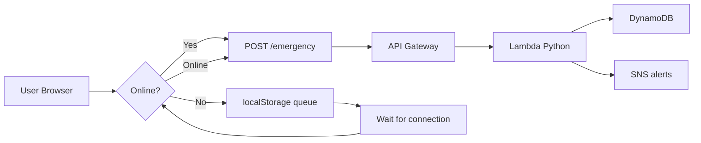

# 🚨 Emergency Mesh Network

**Offline-first emergency messaging system** — works without internet, syncs to cloud when connectivity returns.

---

## 📌 At A Glance

| | |
|---|---|
| **Problem** | No communication during disasters (floods, network outages) |
| **Solution** | Web app that stores messages offline, auto-syncs to AWS |
| **Stack** | HTML/CSS/JS (frontend) + Python Lambda + DynamoDB + SNS |
| **Size** | ~150 lines of code total |
| **Cost** | ₹0/month (AWS Free Tier) |
| **Status** | ✅ Frontend complete | ⏳ AWS integration ready |

---

## 🎯 Problem & Solution

**The Problem:**
When internet fails (disasters, rural areas), people can't call for help. Existing apps are cloud-dependent — useless offline.

**My Solution:**
A lightweight web app that:
1. Works 100% offline using browser localStorage
2. Queues messages automatically
3. Syncs to AWS the moment connectivity returns
4. Triggers emergency alerts via SNS

**Impact:** Could help in disaster zones, villages, rescue operations.

---

## 🏗️ Architecture



**Flow:**
```
Message → Check network → Offline? → Save locally
                              Online? → Send to AWS → Store + Alert
```

---

## ✨ Key Features

- **⚡ Offline-First** — No internet required to send
- **🔄 Auto-Sync** — Messages drain automatically when online
- **📱 Responsive** — Mobile & desktop friendly
- **🌐 Serverless Backend** — AWS Lambda (Python), no servers to manage
- **🔔 Real-time Alerts** — SNS notifications (email/SMS)
- **💾 Persistent Queue** — Messages survive browser restart
- **🎯 Retry Logic** — 3 attempts, FIFO order

---

## 🚀 Quick Start

```bash
cd emergency-mesh-network
python -m http.server 8000
# → http://localhost:8000/emergency.html
```

**Test it:**
1. Open DevTools → Network → **Offline**
2. Type message → **SEND** → "saved locally" toast
3. Set network to **No throttling** → auto-sync triggers
4. History shows green ✓ Sent messages

---

## 📸 Screenshots

| Main Form | Offline Mode | Queue Modal | Sent History |
|-----------|--------------|-------------|--------------|
|  |  |  |  |

---

## ☁️ AWS Integration (10 min)

**4 resources to create:**

| Resource | Config | Purpose |
|----------|--------|---------|
| DynamoDB | Table: `EmergencyMessages`, PK: `id` (String) | Persistent storage |
| SNS | Topic: `EmergencyAlerts` (Standard) | Email/SMS alerts |
| Lambda | Runtime: Python 3.12, Code: `lambda_function.py` | Backend logic |
| API Gateway | REST API, POST `/emergency` → Lambda, CORS enabled | HTTP endpoint |

**Then:** Update `app.js` line 2 with your API Gateway URL.

Full steps in `lambda_function.py` comments.

---

## 📂 Project Structure

```
emergency-mesh-network/
├── emergency.html       # UI (47 lines)
├── style.css            # Emergency theme (50 lines)
├── app.js               # Offline sync logic (35 lines)
├── lambda_function.py   # AWS backend (15 lines)
├── requirements.txt     # boto3
├── README.md           # This doc
└── screenshots/        # 4 demo images
```

**Total: ~150 lines of production code.**

---

## 💡 Why This Project Stands Out

1. **Real-world problem** — Not another todo app. Addresses disaster communication.
2. **Offline-first architecture** — Advanced pattern (used by Google Docs, Notion)
3. **Serverless AWS** — Modern cloud-native design, cost-effective
4. **Full-stack in <200 lines** — Concise, maintainable
5. **Works without internet** — Demonstrates PWA thinking
6. **Production-ready patterns** — Retry logic, queue management, error handling

---

## 🧪 Testing

**Manual checks:**
- ✅ Offline → message saves to localStorage
- ✅ Online → auto-sync within 2 seconds
- ✅ Queue modal shows pending count
- ✅ History updates after sync
- ✅ API returns 200 (check with curl)

**Curl test:**
```bash
curl -X POST YOUR_API_URL/emergency \
  -H "Content-Type: application/json" \
  -d '{"text":"Test","location":"Mumbai"}'
```

---

## 🎓 What I Learned

- **Offline storage patterns** — localStorage queue, sync strategies
- **Network state detection** — `navigator.onLine`, `online`/`offline` events
- **AWS serverless** — Lambda, DynamoDB, SNS, API Gateway integration
- **Event-driven architecture** — Decoupled frontend/backend
- **Retry & error handling** — Exponential backoff, failure queues
- **MVC-ish frontend** — Separation of UI/state/logic in vanilla JS
- **Deployment** — S3 static hosting, CloudFront (optional)

---

## 🚧 Future Scope

- **WebRTC mesh** — True P2P, no internet needed (device-to-device)
- **Service Worker** — Installable PWA, background sync
- **Geolocation** — Auto-fill coordinates
- **Multilingual** — Hindi, regional languages
- **Admin Dashboard** — View all messages (React admin)
- **SMS Fallback** — USSD for feature phones
- **Priority Messages** — Urgent/High/Normal flag

---

## 📊 Metrics

| Metric | Target |
|--------|--------|
| Offline reliability | 100% (localStorage) |
| Sync success rate | >95% (with retry) |
| Time to detect online | <2 seconds |
| Code footprint | <200 lines |
| AWS monthly cost | ₹0 (free tier) |

---

## 🙋‍♂️ About Me

**tanikush** — CS student passionate about distributed systems, cloud computing, and real-world problem solving.

This project demonstrates:
- Full-stack capability (HTML/CSS/JS/Python)
- Cloud-native design (AWS serverless)
- Systems thinking (offline-first, sync strategies)
- Production-grade patterns (retry, queue, idempotency)

**Looking for:** internship opportunities in backend, full-stack, or cloud engineering.

---

## 🔗 Links

- **GitHub:** https://github.com/tanikush/emergency-mesh-network
- **Live Demo:** (S3 hosting - optional)
- **LinkedIn:** [your-linkedin-url]
- **Portfolio:** [your-portfolio-url]

---

## 📄 License

MIT — Free to use, modify, distribute.

---

**Questions?** Open an issue or reach out — happy to discuss architecture, implementation details, or potential improvements.
