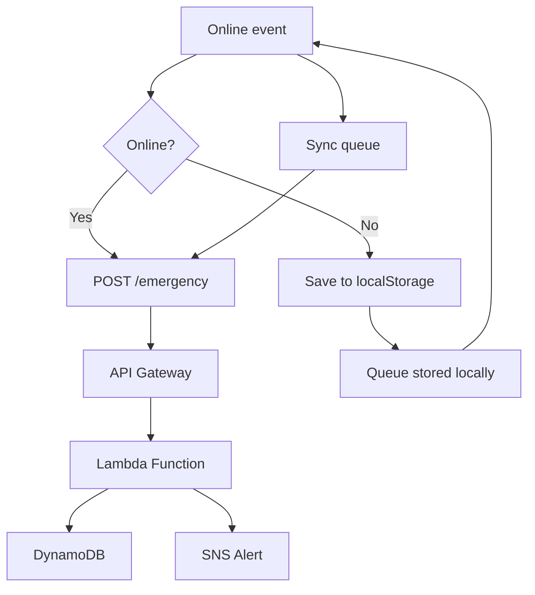

# 🚨 Emergency Mesh Network

**Offline-first emergency messaging system** — works without internet. Messages queue locally and auto-sync to AWS when connectivity returns.

---

## 👋 Quick Demo

```bash
cd emergency-mesh-network
python -m http.server 8000
# Open: http://localhost:8000/emergency.html
```

**Test offline:** DevTools → Network → Offline → Send message → Message saved locally.  
**Test online:** Network → No throttling → Auto-sync to AWS.

---

## ✨ Features

| Feature | Description |
|---------|-------------|
| 🔌 **Offline-First** | Works 100% without internet (localStorage) |
| 🔄 **Auto-Sync** | Messages send automatically when connection returns |
| 📡 **Message Queue** | Pending messages visible in modal |
| ☁️ **AWS Backend** | Serverless: Lambda + DynamoDB + SNS |
| 📱 **Mobile Responsive** | Works on all screen sizes |
| 💰 **Free Tier** | ₹0 cost on AWS (within limits) |

---

## 🏗️ Architecture



### Data Flow

```
User types message
    ↓
Check navigator.onLine
    ├─ Online → POST AWS immediately
    └─ Offline → localStorage queue
    ↓
When online again → auto-sync pending
    ↓
Lambda → DynamoDB + SNS alert
```

---

## 🚀 Quick Start

### 1. Run Locally

```bash
cd emergency-mesh-network
python -m http.server 8000
```

Open browser: **http://localhost:8000/emergency.html**

### 2. Test Offline Mode

1. Press `F12` → **Network** tab
2. Set throttling to **Offline**
3. Type message → Click **SEND**
4. See toast: "Offline: saved locally"
5. Messages appear in **pending queue**

### 3. Test Sync

1. Set network back to **No throttling** (online)
2. Messages auto-sync → toast: "All synced!"
3. History shows **green-bordered** sent messages

---

## ☁️ AWS Deployment (10 min)

### Resources to Create

| Resource | Name | Purpose |
|----------|------|---------|
| DynamoDB Table | `EmergencyMessages` | Store messages |
| SNS Topic | `EmergencyAlerts` | Emergency alerts |
| Lambda Function | `EmergencyHandler` | Backend logic |
| API Gateway | `EmergencyMeshAPI` | REST endpoint |

### Step-by-Step

1. **DynamoDB** → Create table `EmergencyMessages` (id = String, on-demand billing)
2. **SNS** → Create topic `EmergencyAlerts` → Copy ARN
3. **Lambda** → Upload `lambda_function.py` → Add env vars:
   ```
   TABLE=EmergencyMessages
   SNS_ARN=<your-sns-arn>
   ```
   Attach policies: `DynamoDBFullAccess`, `SNSFullAccess`
4. **API Gateway** → Create REST API → `/emergency` POST → Lambda → Enable CORS → Deploy to `prod`
5. **Update frontend** → Edit `app.js` line 2:
   ```javascript
   const API_URL = 'YOUR_API_GATEWAY_URL/emergency';
   ```
6. **Test** → Send message → Check DynamoDB console

Detailed guide: See comments in `lambda_function.py` and `app.js`.

---

## 📂 Project Structure

```
emergency-mesh-network/
├── emergency.html           # UI (form, history, modal)
├── style.css                # Dark emergency theme
├── app.js                   # Offline logic (~35 lines)
├── lambda_function.py       # Backend (~15 lines)
├── requirements.txt         # boto3
├── README.md               # This file
├── ARCHITECTURE.md          # Technical deep-dive
└── screenshots/            # Demo images
    ├── main-ui.png
    ├── offline-mode.png
    ├── queue-modal.png
    └── history.png
```

---

## 🧪 Testing Checklist

- [ ] Page loads at `http://localhost:8000/emergency.html`
- [ ] Offline mode: status bar red, messages save to localStorage
- [ ] Queue modal: "View" button shows pending messages
- [ ] Online mode: status bar green, auto-sync triggered
- [ ] AWS: Messages appear in DynamoDB table
- [ ] SNS: Alerts received via email/SMS (if subscription confirmed)

---

## 💡 How It Works (Code)

### Frontend (app.js)

```javascript
// Check connectivity
if (navigator.onLine) {
    await sendToAWS(message);  // POST to API
} else {
    saveToLocalStorage(message);  // Queue locally
}

// Auto-sync when online
window.addEventListener('online', syncQueue);
```

### Backend (lambda_function.py)

```python
def lambda_handler(event, context):
    message = json.loads(event['body'])
    table.put_item(Item=message)        # Save
    sns.publish(TopicArn=ARN, Message=message)  # Alert
    return {'statusCode': 200}
```

---

## 📸 Screenshots

### Main Interface

*Emergency form with online/offline status*

### Offline Mode

*Red status bar, message queued locally*

### Queue Modal

*View pending messages before sync*

### Message History

*Green-bordered sent messages with timestamps*

---

## 🐛 Troubleshooting

| Issue | Solution |
|-------|----------|
| Page not loading | Check Python server running on port 8000 |
| Offline not working | Ensure DevTools Network → Offline selected |
| Messages not syncing | Update `API_URL` in `app.js` with real endpoint |
| CORS error | Enable CORS in API Gateway (allow `*`) |
| Lambda 502 error | Check CloudWatch logs, add IAM permissions |
| No SNS alerts | Confirm email subscription, check SNS ARN |

---

## 📊 AWS Free Tier Estimate

| Service | Limit | Usage | Cost |
|---------|-------|-------|------|
| Lambda | 1M requests | ~1K | Free |
| DynamoDB | 25GB | <1MB | Free |
| SNS | 10K publishes | ~100 | Free |
| API Gateway | 1M calls | ~1K | Free |
| **Total** | | | **₹0** |

---

## 🎯 Future Enhancements

- **PWA** — Service worker for installable app
- **WebRTC** — True mesh P2P (no server)
- **Geolocation** — Auto-capture coordinates
- **Multilingual** — Hindi + regional languages
- **QR Sharing** — Bluetooth/NFC message transfer
- **Priority Levels** — Urgent/normal flag
- **Admin Dashboard** — Web interface to view all messages
- **SMS Fallback** — USSD for feature phones

---

## 📖 Learning Resources

- [AWS Lambda Docs](https://docs.aws.amazon.com/lambda/)
- [DynamoDB Getting Started](https://aws.amazon.com/dynamodb/)
- [JavaScript.info (Async)](https://javascript.info/async)
- [MDN: navigator.onLine](https://developer.mozilla.org/en-US/docs/Web/API/NavigatorOnLine/onLine)

---

## 👨‍💻 Built By

**tanikush** — Portfolio project demonstrating offline-first architecture, AWS serverless, and real-world problem solving.

**Perfect for internships:** Shows full-stack ability beyond CRUD apps.

---

## 📄 License

MIT — Free to use, modify, distribute.

---

**🔗 GitHub:** https://github.com/tanikush/emergency-mesh-network
