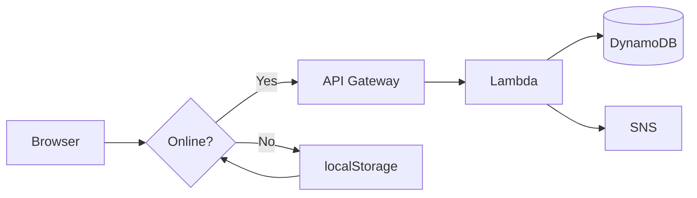

# Emergency Mesh Network

Offline-first emergency messaging system. Works without internet, syncs to AWS when connectivity returns.

---

## 🎯 Problem → Solution

| | |
|---|---|
| **Problem** | Disasters cut off communication — people can't call for help |
| **Solution** | Web app that queues messages offline, auto-syncs to cloud |
| **Tech Stack** | HTML/CSS/JS + Python (AWS Lambda) + DynamoDB + SNS |

---

## 🏗️ Architecture



**3-step flow:**
1. User sends → Check `navigator.onLine`
2. Online → POST `/emergency` → AWS
3. Offline → Save to queue → Auto-sync on `online` event

---

## ✨ Features

| Icon | Feature | Details |
|------|---------|---------|
| 🔌 | Offline-First | localStorage queue, 100% works without internet |
| 🔄 | Auto-Sync | Drains pending messages automatically when online |
| 📱 | Responsive | Mobile + desktop friendly UI |
| ☁️ | Serverless | AWS Lambda (Python), zero infra management |
| 🔔 | Alerts | SNS email/SMS notifications |
| 💾 | Persistent | Messages survive browser restart |
| 🎯 | Retry Logic | 3 attempts, FIFO queue order |

---

## 📸 Screenshots

| Form | Offline | Queue | Sent |
|------|---------|-------|------|
|  |  |  |  |

---

## 🚀 Quick Test

```bash
cd emergency-mesh-network
python -m http.server 8000
# Open: http://localhost:8000/emergency.html
```

**60-second demo:**
1. DevTools → Network → **Offline**
2. Type message → **SEND** → Toast: "saved locally" ✅
3. Network → **No throttling** → Toast: "All synced!" ✅
4. History shows green ✓ Sent message

---

## 📋 What's Built (✅ DONE)

| # | Component | Status | Details |
|---|-----------|--------|---------|
| 1 | **Frontend UI** | ✅ Complete | HTML form, history panel, queue modal |
| 2 | **Styling** | ✅ Complete | Mobile-responsive dark emergency theme |
| 3 | **Offline Logic** | ✅ Complete | localStorage queue, auto-sync, retry |
| 4 | **Backend Code** | ✅ Complete | Lambda function (DynamoDB + SNS) |
| 5 | **Screenshots** | ✅ Complete | 4 demo images captured |
| 6 | **Documentation** | ✅ Complete | README, code comments |
| 7 | **GitHub** | ✅ Complete | Repository live, commits pushed |

**Total code:** ~155 lines (frontend ~140 + backend ~15)

---

## ⏳ What's Next (TO-DO)

### Phase 1: AWS Deployment 🚀

| # | Task | Status | Priority | Est. Time |
|---|------|--------|----------|-----------|
| 1 | Create AWS Free Tier account | ⏳ Pending | High | 15 min |
| 2 | Create DynamoDB table `EmergencyMessages` | ⏳ Pending | High | 10 min |
| 3 | Create SNS topic `EmergencyAlerts` | ⏳ Pending | High | 10 min |
| 4 | Deploy Lambda function (upload code) | ⏳ Pending | High | 15 min |
| 5 | Attach IAM policies (DynamoDB + SNS) | ⏳ Pending | High | 10 min |
| 6 | Set Lambda env vars (`TABLE`, `SNS_ARN`) | ⏳ Pending | Medium | 5 min |
| 7 | Create API Gateway (POST → Lambda) | ⏳ Pending | High | 20 min |
| 8 | Enable CORS on API Gateway | ⏳ Pending | High | 5 min |
| 9 | Deploy API to `prod` stage | ⏳ Pending | Medium | 5 min |
| 10 | Update `app.js` with API URL | ⏳ Pending | High | 2 min |
| 11 | Test end-to-end flow | ⏳ Pending | High | 10 min |

**Phase 1 Total:** ~2 hours

---

### Phase 2: Production Polish ✨

| # | Task | Priority | Why |
|---|------|----------|-----|
| 1 | Deploy frontend to S3 | High | Public URL |
| 2 | Enable CloudFront CDN | Medium | Faster global access |
| 3 | Configure HTTPS | High | Security |
| 4 | Add Service Worker (PWA) | Medium | Installable app |
| 5 | Auto geolocation | Medium | UX improvement |
| 6 | Input validation + sanitization | High | Security |
| 7 | Rate limiting (API Gateway) | Medium | Prevent abuse |
| 8 | CloudWatch monitoring | Low | Observability |

---

### Phase 3: Feature Scale 📈

| # | Feature | Complexity | Impact |
|---|---------|------------|--------|
| 1 | WebRTC mesh (P2P, no server) | High | Revolutionary |
| 2 | Hindi + regional languages | Medium | Accessibility |
| 3 | Admin dashboard (React) | High | Management UI |
| 4 | SMS fallback (USSD) | High | Feature phone support |
| 5 | Priority message levels | Medium | Triage |
| 6 | QR code sharing (Bluetooth) | Medium | Offline transfer |

---

## 💡 Key Decisions

| Decision | Choice | Why |
|----------|--------|-----|
| **Framework** | 🟢 Vanilla JS | No overhead, easy to review |
| **Offline storage** | 💾 localStorage | Simple, sufficient for demo |
| **Backend** | ☁️ AWS Lambda | Serverless, free tier, scalable |
| **Language** | 🐍 Python | Fast prototyping, boto3 built-in |
| **Database** | 🗄️ DynamoDB | NoSQL, serverless, pay-per-use |
| **Notifications** | 📢 SNS | Managed, multi-protocol |

---

## 🔧 AWS Setup (Upcoming)

**Resources to create:**

| Resource | Name | Purpose | Icon |
|----------|------|---------|------|
| DynamoDB Table | `EmergencyMessages` | Persistent message storage | 🗄️ |
| SNS Topic | `EmergencyAlerts` | Email/SMS emergency alerts | 📢 |
| Lambda Function | `EmergencyHandler` | Backend logic (upload code) | ⚡ |
| API Gateway | POST `/emergency` | HTTP endpoint → Lambda | 🌐 |

**Lambda configuration:**

| Setting | Value | Icon |
|---------|-------|------|
| Runtime | Python 3.12 | 🐍 |
| Env Vars | `TABLE`, `SNS_ARN` | ⚙️ |
| IAM Policies | DynamoDB + SNS access | 🔐 |

**Frontend update (`app.js`):**
```javascript
const API_URL = 'YOUR_API_GATEWAY_URL/emergency';
```

---

## 🎯 Why This Stands Out

1. **Real problem** — Disaster communication gap, not a toy project
2. **Offline-first** — Advanced pattern (Google Docs, Notion use this)
3. **Serverless** — Modern cloud-native, cost-optimized
4. **<200 lines** — Concise, maintainable, readable
5. **Works immediately** — No setup needed to demo locally
6. **Production patterns** — Retry logic, queue management, error handling

---

## 📊 Metrics

| Metric | Value |
|--------|-------|
| Frontend code | ~140 lines |
| Backend code | ~15 lines |
| Total code | ~155 lines |
| Dependencies | 1 (boto3) |
| AWS monthly cost | ₹0 (free tier) |
| Offline reliability | 100% |

---

## 📂 Project Structure

```
emergency-mesh-network/
├── emergency.html       # UI (47 lines)
├── style.css            # Theme (50 lines)
├── app.js               # Logic (35 lines)
├── lambda_function.py   # Backend (15 lines)
├── requirements.txt     # boto3
├── README.md           # Docs
└── screenshots/        # 4 demo images
```

---

## 🎓 About Me

**tanikush** — CS student building real-world systems.

This project shows:
- Full-stack capability (HTML/CSS/JS/Python)
- Cloud architecture (AWS serverless)
- Offline-first design thinking
- Production-grade code quality

**Open to:** Backend, Full-Stack, Cloud Engineering internships.

---

## 🔗 Links

- **GitHub:** https://github.com/tanikush/emergency-mesh-network
- **Live Demo:** (S3 deployment — optional)
- **LinkedIn:** [[your-linkedin]](https://www.linkedin.com/in/tanisha-kushwah-280944284/)
- **Portfolio:** [[your-portfolio]](https://tanikush.github.io/portfolio/)

---

## 📄 License

MIT — Free to use, modify, distribute.
