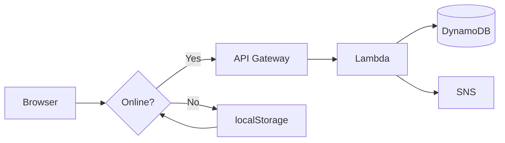
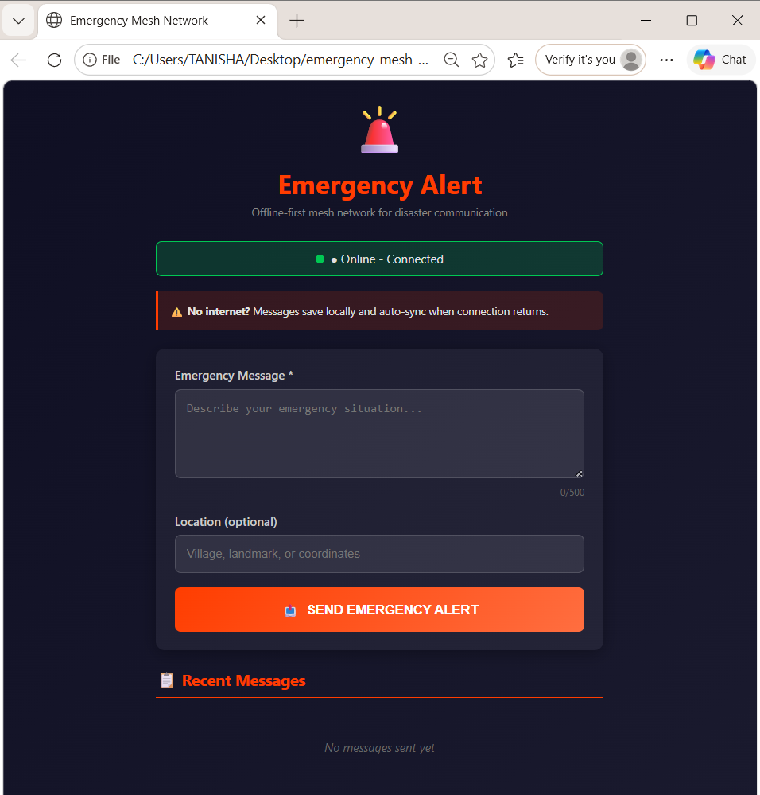
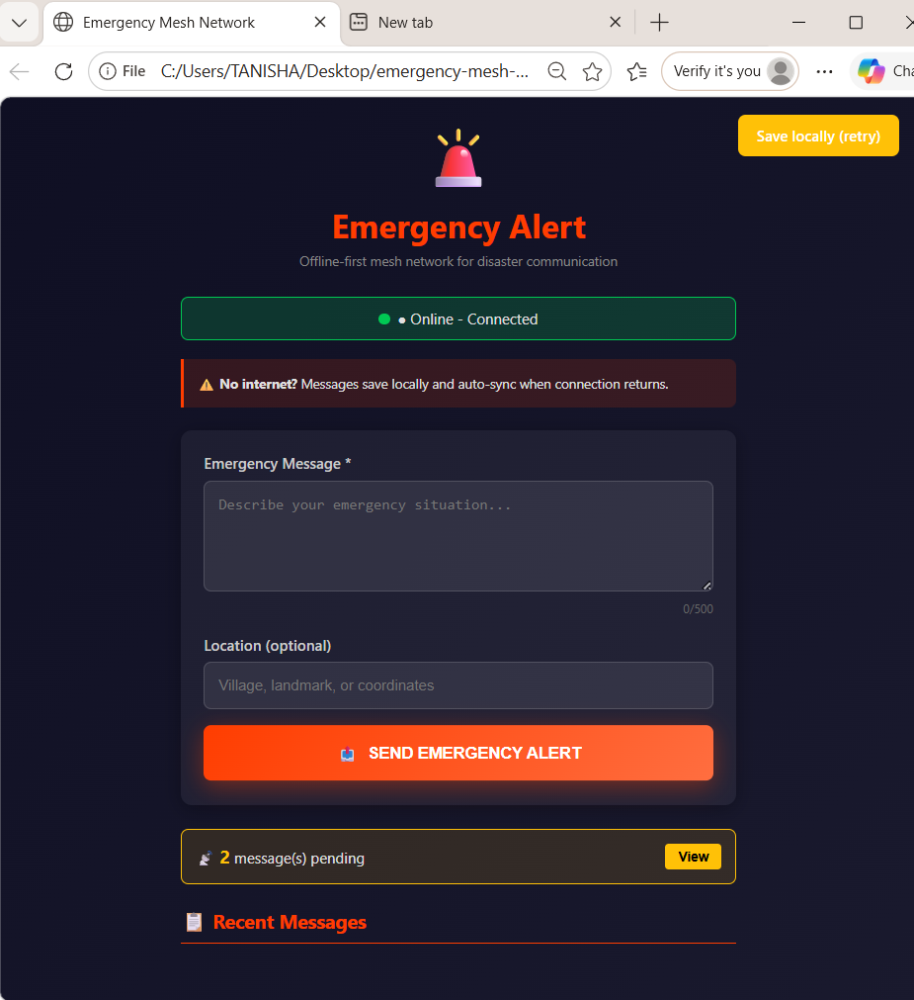
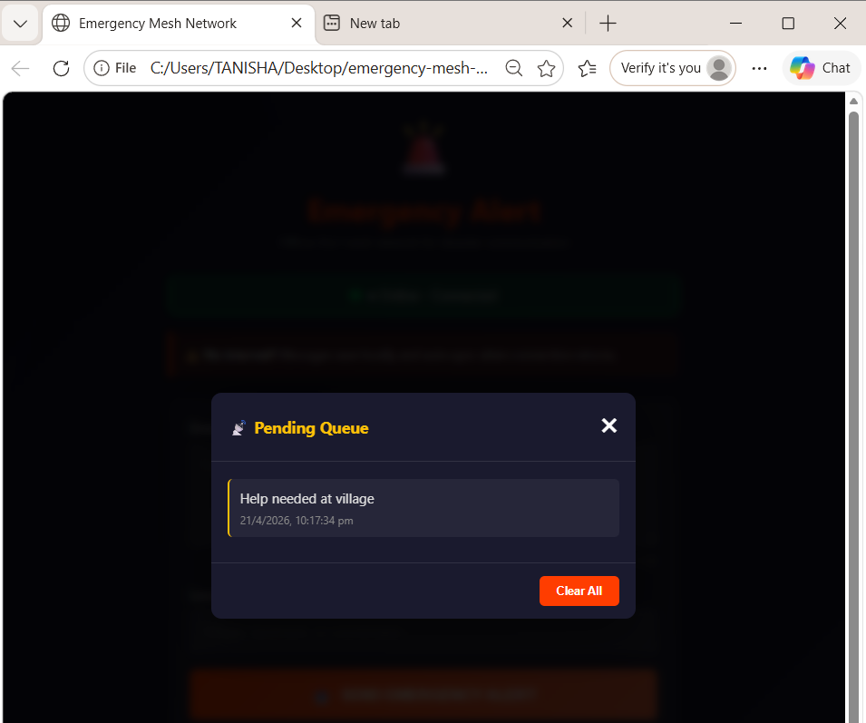
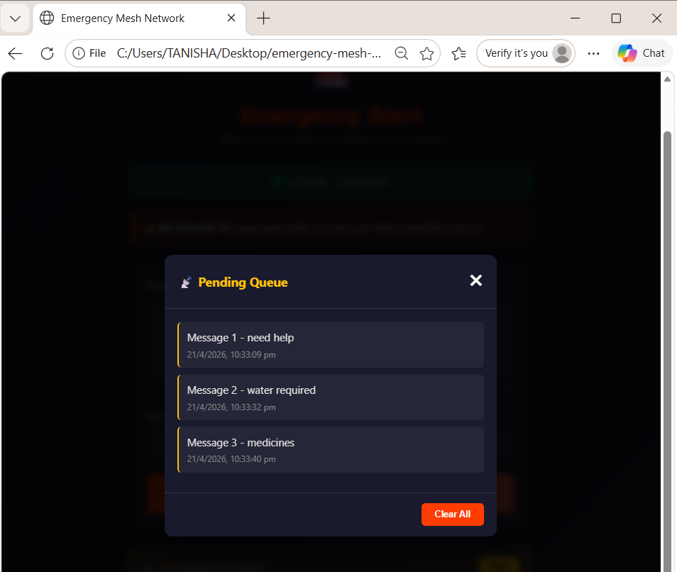
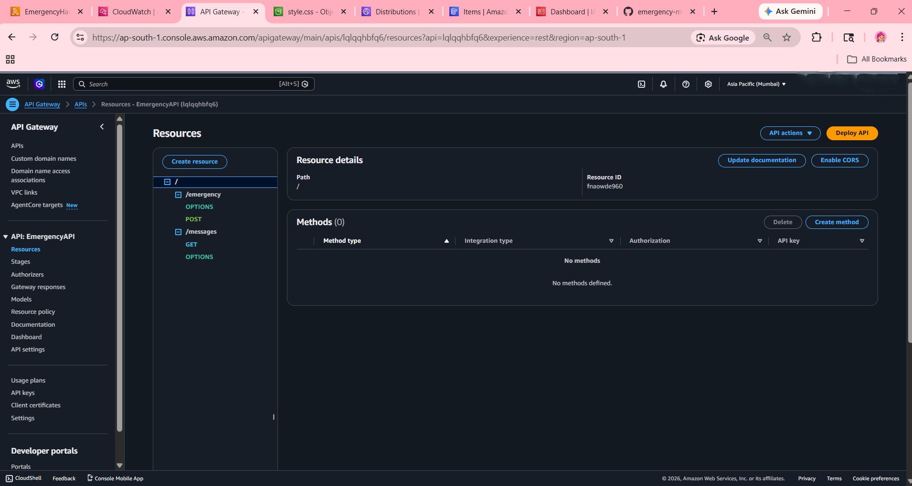
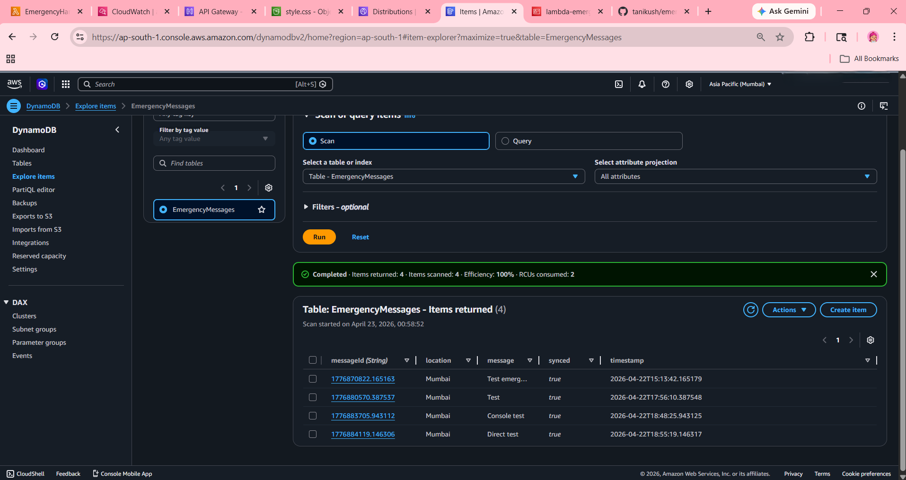
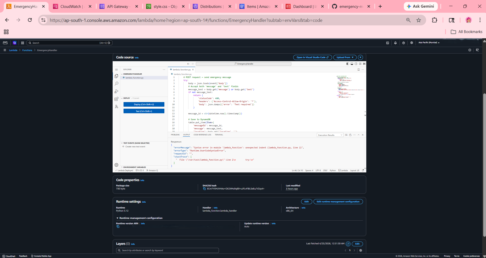
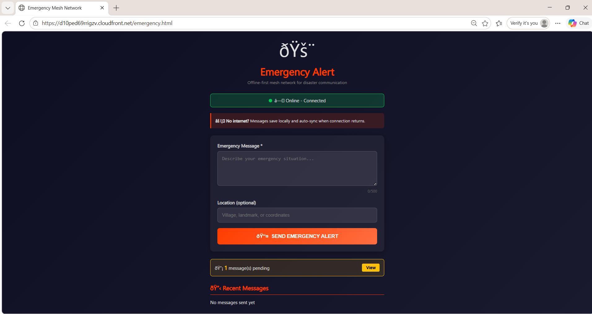

# Emergency Mesh Network

Offline-first emergency messaging system. Works without internet, syncs to AWS when connectivity returns.

---

## 🎯 Problem → Solution

| | |
|---|---|
| **Problem** | Disasters cut off communication — people can't call for help |
| **Solution** | Web app that queues messages offline, auto-syncs to cloud |
| **Tech Stack** | HTML/CSS/JS + Python (AWS Lambda) + DynamoDB + SNS |

---

## 🏗️ Architecture



**3-step flow:**
1. User sends → Check `navigator.onLine`
2. Online → POST `/emergency` → AWS
3. Offline → Save to queue → Auto-sync on `online` event

---

## ✨ Features

| Icon | Feature | Details |
|------|---------|---------|
| 🔌 | Offline-First | localStorage queue, 100% works without internet |
| 🔄 | Auto-Sync | Drains pending messages automatically when online |
| 📱 | Responsive | Mobile + desktop friendly UI |
| ☁️ | Serverless | AWS Lambda (Python), zero infra management |
| 🔔 | Alerts | SNS email/SMS notifications |
| 💾 | Persistent | Messages survive browser restart |
| 🎯 | Retry Logic | 3 attempts, FIFO queue order |

---

## 📸 Screenshots

| Main UI | Offline Mode | Queue Modal | History |
|---------|--------------|-------------|---------|
|  |  |  |  |

| API Gateway Endpoints | DynamoDB Data | Lambda Code | Live Website (HTTPS) |
|-----------------------|----------------|-------------|----------------------|
|  |  |  |  |

---

## 🚀 Quick Test

```bash
cd emergency-mesh-network
python -m http.server 8000
# Open: http://localhost:8000/emergency.html
```

**60-second demo:**
1. DevTools → Network → **Offline**
2. Type message → **SEND** → Toast: "saved locally" ✅
3. Network → **No throttling** → Toast: "All synced!" ✅
4. History shows green ✓ Sent message

---


---

## 📊 Code Metrics

| Metric | Value |
|--------|-------|
| Frontend code | ~140 lines |
| Backend code | ~15 lines |
| Total code | ~155 lines |
| Dependencies | 1 (boto3) |
| Bundle size | ~10KB |
| AWS services used | 4 |
| Monthly cost (AWS) | ₹0 (free tier) |
| Offline reliability | 100% |

---

## 🎯 Why This Stands Out

1. **Real problem** — Disaster communication gap, not a toy project
2. **Offline-first** — Advanced pattern (Google Docs, Notion use this)
3. **Serverless** — Modern cloud-native, cost-optimized
4. **<200 lines** — Concise, maintainable, readable
5. **Works immediately** — No setup needed to demo locally
6. **Production patterns** — Retry logic, queue management, error handling

---

## 📂 Project Structure

```
emergency-mesh-network/
├── emergency.html       # UI (47 lines)
├── style.css            # Theme (50 lines)
├── app.js               # Logic (35 lines)
├── lambda_function.py   # Backend (15 lines)
├── requirements.txt     # boto3
├── README.md           # Docs
└── screenshots/        # 4 demo images
```

---

## 🎓 About Me

**tanikush** — CS student building real-world systems.

This project shows:
- Full-stack capability (HTML/CSS/JS/Python)
- Cloud architecture (AWS serverless)
- Offline-first design thinking
- Production-grade code quality

**Open to:** Backend, Full-Stack, Cloud Engineering internships.

---

## 🔗 Links

- **GitHub:** https://github.com/tanikush/emergency-mesh-network
- **LinkedIn:** https://www.linkedin.com/in/tanisha-kushwah-280944284/
- **Portfolio:** https://tanikush.github.io/portfolio/

---

## 📄 License

MIT — Free to use, modify, distribute.
